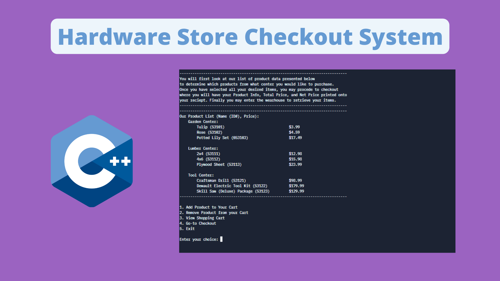

# Hardware-Store-Checkout-System
Hardware store cash register checkout system meant to mimic that of Lowes Home Improvement's old system.

Author: Spencer C. DeMera\
Author's email: Spencer.demera@csu.fullerton.edu

---
Project meant as a theoretical exploration and recreation of various checkout inventory systems observed as being used by some stores such as Lowes. System mimics that of such stores in both functionality and physical appearance to a close degree (provided the limited knowledge of true system functionality of the real systems) and explores what it might look like if written in C/C++. Program makes use of various crucial programming concepts and functionality involving OOP and classes. System is terminal based and relies on menu navigation via numerical input from the command line.
 
---
Development status.  This programs is done.  It fulfills its purpose of creating C/C++ programs and data structure implementations.

Here "program" means all modules or files in the set; usually there are three of these modules in sample programs used in
this course.

---
File execution: These programs were written in Repl.it Virtual online IDE and compiled using Linux.
